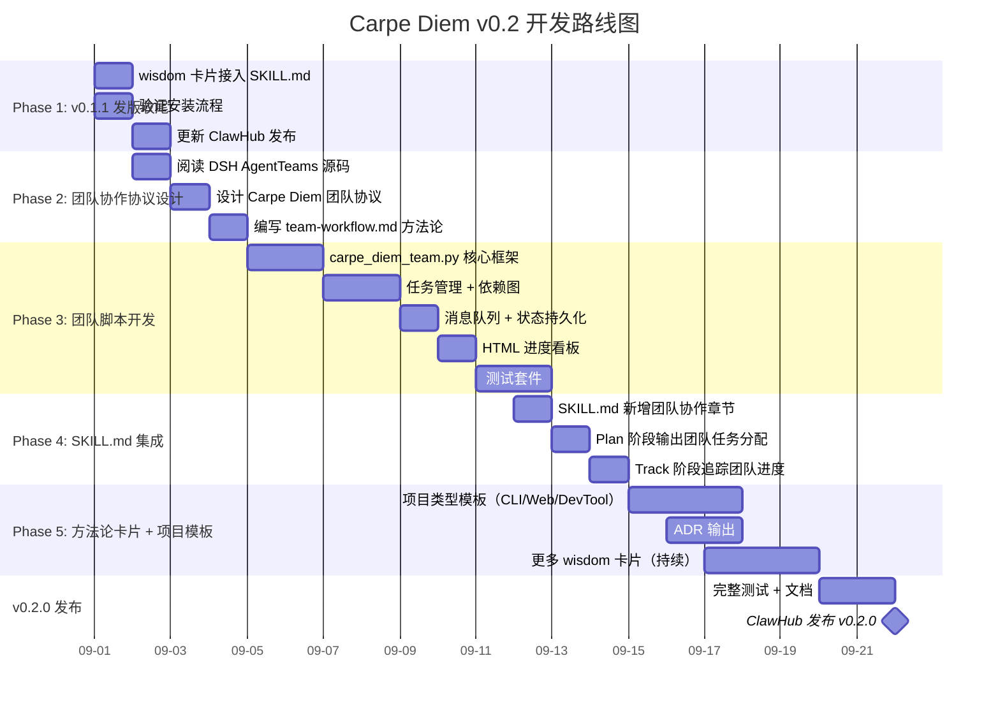

# Carpe Diem v0.2 开发计划：嵌入多 Agent 协作协议

> 计划日期：2026-08-30
> 核心目标：将 AgentTeams 的协作协议嵌入 Carpe Diem，使其成为不依赖 DSH 的独立多 Agent 协作框架

---

## 一、总体架构

```
Carpe Diem Skill
├── SKILL.md                          # 主指令（含协作协议）
├── SKILL.en.md                       # 英文版
├── manifest.json                     # 包清单
│
├── references/
│   ├── methodology.md                # 带领式引导方法论
│   ├── team-workflow.md              # 🔜 多 Agent 协作协议（新增）
│   ├── stage-transition-graph.md     # 阶段转换图
│   ├── stages/                       # 四阶段文件
│   └── wisdom/                       # 方法论卡片
│
├── scripts/
│   ├── carpe_diem.py                 # 现有确定性脚本（1077 行）
│   └── carpe_diem_team.py            # 🔜 团队协作脚本（新增，约 800 行）
│
├── templates/
│   ├── project-plan.md
│   ├── project-handoff.md
│   └── team-progress.md              # 🔜 团队进度模板（新增）
│
├── .carpe-diem/team/
│   └── dashboard.html                # 🔜 自动生成的 HTML 进度看板（新增）
│
└── tests/
    ├── test_state.py
    ├── test_plan.py
    ├── test_project.py
    ├── test_team.py                  # 🔜 团队协作测试（新增）
    └── ...
```

---

## 二、里程碑规划



---

## 三、Phase 1：v0.1.1 发版收尾（3 天）

### 1.1 wisdom 卡片接入 SKILL.md

**文件**：`SKILL.md` → `## 每次调用` 章节

**改动**：在第 5 步之后增加一条：

```markdown
6. 可选：如果用户的项目方向与某个实战模式匹配，
   加载对应的 wisdom 卡片作为参考：
   - 用户想做 AI/Agent 项目 → 加载 `references/wisdom/real-world-patterns/claude-code-best-practices.md`
   - 用户想做工具/基础设施 → 加载 `references/wisdom/real-world-patterns/building-effective-agents.md`
   - 用户想做数据处理/上下文敏感项目 → 加载 `references/wisdom/real-world-patterns/context-engineering.md`
   - 用户想做可扩展平台/技能系统 → 加载 `references/wisdom/real-world-patterns/agent-skills.md`
```

**验收标准**：Agent 在 Discover 阶段识别出用户方向后，能自动选择并加载对应卡片。

### 1.2 验证安装流程

**命令**：
```bash
# 1. 生成安装计划
python3 scripts/carpe_diem.py install plan \
  --platform codex \
  --source . \
  --target /tmp/test-install/carpe-diem \
  --json

# 2. 执行安装
python3 scripts/carpe_diem.py install apply \
  --plan /tmp/install-plan.json \
  --yes

# 3. 验证安装
python3 scripts/carpe_diem.py install verify \
  --target /tmp/test-install/carpe-diem

# 4. 卸载
python3 scripts/carpe_diem.py install uninstall \
  --target /tmp/test-install/carpe-diem \
  --yes
```

**验收标准**：四步全部通过，返回码为 0。

### 1.3 更新 ClawHub 发布

- 在 ClawHub 上发布 v0.1.1
- 更新英文 description（当前只有 63 字，建议 150-200 字）
- 确保 SKILL.en.md 在文件列表中

---

## 四、Phase 2：团队协作协议设计（3 天）

### 2.1 阅读 DSH AgentTeams 源码

需要读懂的 3 个核心文件：

| 文件 | 行数 | 核心内容 | 需要理解 |
|------|------|----------|---------|
| `types.ts` | 219 | 所有类型定义 | Team, Task, Member, Mailbox, Message 的数据结构 |
| `task-board.ts` | 297 | 任务管理 | 任务 CRUD、依赖关系、状态流转、attempt_id 机制 |
| `mailbox.ts` | 338 | 消息队列 | 消息发送、接收、通知、超时清理 |
| `fold.ts` | 291 | 流程编排 | 任务调度、成员分配、自动唤醒逻辑 |

**输出**：`docs/design/agent-teams-protocol-analysis.md` — 记录 DSH AgentTeams 的核心协议设计，作为嵌入方案的参考。

### 2.2 设计 Carpe Diem 团队协议

**文件协议**：

```
.carpe-diem/team/
├── team.json              # 团队元数据
│   {
│     "team_id": "uuid",
│     "name": "project-x",
│     "created_at": "2026-09-01T00:00:00Z",
│     "revision": 1
│   }
│
├── members/               # 成员状态
│   ├── agent-a.json
│   │   { "name": "agent-a", "role": "backend", "status": "idle" }
│   └── agent-b.json
│       { "name": "agent-b", "role": "frontend", "status": "working" }
│
├── tasks/                 # 任务
│   ├── MANIFEST.json      # 任务索引（维护拓扑顺序）
│   ├── t1.json
│   │   {
│   │     "task_id": "t1",
│   │     "subject": "实现登录 API",
│   │     "status": "completed",
│   │     "assignee": "agent-a",
│   │     "dependencies": [],
│   │     "output": "PR #42 merged"
│   │   }
│   └── t2.json
│       {
│         "task_id": "t2",
│         "status": "in_progress",
│         "assignee": "agent-b",
│         "dependencies": ["t1"],
│         ...
│       }
│
└── mailboxes/             # 消息队列
    ├── agent-a/
    │   ├── 0001.json
    │   └── 0002.json
    └── agent-b/
        └── 0001.json
```

**核心设计原则**：

1. **文件即 API** — 所有操作都是读写文件，不需要网络服务
2. **MANIFEST 作为唯一事实源** — 任务列表以 MANIFEST.json 为准，避免目录遍历不一致
3. **revision 乐观锁** — 每次写入检查 revision，防止并发覆盖
4. **消息文件递增编号** — 按序号读取，支持"只读新消息"

### 2.3 编写 team-workflow.md 方法论

**文件**：`references/team-workflow.md`

**内容结构**：

```markdown
# 多 Agent 团队协作协议

## 什么时候用

当项目的 Plan 阶段完成后，需要多个 Agent 协作开发时。

## 核心概念

- Team：一个项目对应一个团队
- Member：参与开发的 Agent
- Task：分配给成员的任务，可以依赖其他任务
- Mailbox：成员的消息队列

## 文件协议

.carpe-diem/team/ 目录结构...

## 工作流

1. 主 Agent 创建团队
2. 主 Agent 分配任务
3. 成员认领任务
4. 成员完成任务
5. 主 Agent 汇总进度

## 子命令

python3 <skill-root>/scripts/carpe_diem_team.py <command> ...
```

---

## 五、Phase 3：团队脚本开发（7 天）

### 3.1 `carpe_diem_team.py` 核心框架

**文件**：`scripts/carpe_diem_team.py`（新增，约 800 行）

**子命令设计**：

```
team create <name>                    # 创建团队
team status                           # 查看团队状态
team delete                           # 删除团队

member add <name> --role <role>       # 添加成员
member remove <name>                  # 移除成员
member status <name>                  # 查看成员状态

task create <subject>                 # 创建任务
  --assignee <name>                   # 分配给成员
  --depends-on <task_id>              # 依赖任务
task list                             # 列出任务
task claim <task_id>                  # 认领任务
task update <task_id>                 # 更新任务状态
  --status <status>                   # pending/in_progress/completed/failed
  --output <text>                     # 完成输出

message send <to> <content>           # 发送消息
message list                          # 查看未读消息
```

**对比 DSH AgentTeams 的简化**：

| DSH 功能 | 嵌入式方案 | 原因 |
|----------|-----------|------|
| 自动唤醒成员 | 无，成员自己读任务 | 跨平台无法统一唤醒机制 |
| attempt_id 机制 | 无，用 revision 替代 | 简化实现，足够用 |
| 团队成员间直接通信 | 通过 mailbox 单向通信 | 避免复杂路由 |
| 分布式状态 | 本地文件系统 | 跨机器场景用 Git 同步 |

### 3.2 任务管理 + 依赖图

**task-board.ts 的核心逻辑翻译**：

```python
# 拓扑排序（从 task-graph.ts 翻译）
def topological_sort(task_ids: list[str]) -> list[str]:
    """返回按依赖顺序排列的任务 ID 列表。"""
    ...

# 可认领任务（从 task-board.ts 翻译）
def claimable_tasks() -> list[Task]:
    """返回所有依赖已完成且状态为 pending 的任务。"""
    ...

# 修订冲突检测
def atomic_write_json(path: Path, data: dict) -> None:
    """写入前检查 revision，原子替换。"""
    ...
```

### 3.3 消息队列 + 状态持久化 + HTML 进度看板

**mailbox.ts 的核心逻辑翻译**：

```python
def send_message(team_dir: Path, to: str, content: str) -> int:
    """向成员发送消息，返回消息序号。"""
    mailbox_dir = team_dir / "mailboxes" / to
    mailbox_dir.mkdir(parents=True, exist_ok=True)
    seq = len(list(mailbox_dir.glob("*.json"))) + 1
    msg = {
        "seq": seq,
        "from": "carpe-diem",
        "content": content,
        "sent_at": utc_now(),
    }
    atomic_write_json(mailbox_dir / f"{seq:04d}.json", msg)
    return seq

def read_messages(team_dir: Path, name: str, after_seq: int = 0) -> list[dict]:
    """读取成员 after_seq 之后的未读消息。"""
    mailbox_dir = team_dir / "mailboxes" / name
    messages = []
    for path in sorted(mailbox_dir.glob("*.json")):
        msg = json.loads(path.read_text())
        if msg["seq"] > after_seq:
            messages.append(msg)
    return messages
```

### 3.4 HTML 进度看板

**新增子命令**：`team dashboard --html`

在 `carpe_diem_team.py` 中新增一个子命令，读取 `.carpe-diem/team/` 下的所有任务状态，生成一个独立的 HTML 文件。

**HTML 看板设计**：

```html
<!-- .carpe-diem/team/dashboard.html -->
<!DOCTYPE html>
<html lang="zh-CN">
<head>
  <meta charset="UTF-8">
  <meta name="viewport" content="width=device-width, initial-scale=1.0">
  <title>项目进度 - {project_name}</title>
  <style>
    * { margin: 0; padding: 0; box-sizing: border-box; }
    body {
      font-family: -apple-system, BlinkMacSystemFont, "Segoe UI", Roboto, sans-serif;
      background: #f5f5f7;
      padding: 32px;
      color: #1d1d1f;
    }
    .header { margin-bottom: 24px; }
    .header h1 { font-size: 24px; font-weight: 700; }
    .header .meta { color: #86868b; font-size: 14px; margin-top: 4px; }

    .stats { display: flex; gap: 16px; margin-bottom: 24px; }
    .stat-card {
      flex: 1; padding: 16px; border-radius: 12px; background: white;
      box-shadow: 0 1px 3px rgba(0,0,0,0.08);
    }
    .stat-card .number { font-size: 32px; font-weight: 700; }
    .stat-card .label { font-size: 13px; color: #86868b; margin-top: 4px; }
    .stat-card.done .number { color: #34c759; }
    .stat-card.doing .number { color: #ff9500; }
    .stat-card.waiting .number { color: #8e8e93; }

    .progress-bar { height: 6px; background: #e5e5ea; border-radius: 3px; margin-bottom: 24px; }
    .progress-bar .fill { height: 100%; background: #34c759; border-radius: 3px; transition: width 0.3s; }

    .board { display: grid; grid-template-columns: repeat(3, 1fr); gap: 16px; }
    .column { background: white; border-radius: 12px; padding: 16px; box-shadow: 0 1px 3px rgba(0,0,0,0.08); }
    .column h2 { font-size: 15px; font-weight: 600; margin-bottom: 12px; color: #86868b; text-transform: uppercase; letter-spacing: 0.5px; }
    .card {
      padding: 12px; border-radius: 8px; margin-bottom: 8px;
      border: 1px solid #e5e5ea; font-size: 14px;
    }
    .card .assignee { font-size: 12px; color: #86868b; margin-top: 4px; }
    .card.done { background: #f0fff0; border-color: #b8e6b8; }
    .card.doing { background: #fff8f0; border-color: #ffe0b8; }
    .card.waiting { background: #f8f8fa; border-color: #e5e5ea; }
    .card .dep { font-size: 11px; color: #ff3b30; margin-top: 4px; }

    .timeline { margin-top: 24px; padding: 16px; background: white; border-radius: 12px; box-shadow: 0 1px 3px rgba(0,0,0,0.08); }
    .timeline h2 { font-size: 15px; font-weight: 600; margin-bottom: 12px; }
    .timeline-item { display: flex; gap: 12px; padding: 8px 0; border-bottom: 1px solid #f0f0f0; font-size: 13px; }
    .timeline-item .time { color: #86868b; white-space: nowrap; min-width: 140px; }
    .timeline-item .event { flex: 1; }
    .timeline-item:last-child { border-bottom: none; }
  </style>
</head>
<body>
  <div class="header">
    <h1>📋 {project_name}</h1>
    <div class="meta">更新于 {updated_at} · 团队协作模式</div>
  </div>

  <div class="stats">
    <div class="stat-card done">
      <div class="number">{done_count}</div>
      <div class="label">已完成</div>
    </div>
    <div class="stat-card doing">
      <div class="number">{doing_count}</div>
      <div class="label">进行中</div>
    </div>
    <div class="stat-card waiting">
      <div class="number">{waiting_count}</div>
      <div class="label">等待中</div>
    </div>
  </div>

  <div class="progress-bar">
    <div class="fill" style="width: {progress_percent}%"></div>
  </div>

  <div class="board">
    <div class="column">
      <h2>✅ 已完成</h2>
      {done_cards}
    </div>
    <div class="column">
      <h2>🔄 进行中</h2>
      {doing_cards}
    </div>
    <div class="column">
      <h2>⏳ 等待中</h2>
      {waiting_cards}
    </div>
  </div>

  <div class="timeline">
    <h2>📜 最近活动</h2>
    {timeline_items}
  </div>
</body>
</html>
```

**生成的看板效果**：

```
┌─────────────────────────────────────────────────┐
│  📋 my-project                    2026-09-01    │
├─────────────────────────────────────────────────┤
│  ┌──────────┐  ┌──────────┐  ┌──────────┐      │
│  │    1     │  │    1     │  │    2     │      │
│  │  已完成  │  │  进行中  │  │  等待中  │      │
│  └──────────┘  └──────────┘  └──────────┘      │
│  ████████░░░░░░░░░░░░░░░░░░ 25%                 │
├─────────────────────────────────────────────────┤
│  ✅ 已完成        🔄 进行中      ⏳ 等待中     │
│  ┌────────────┐  ┌────────────┐  ┌────────────┐ │
│  │ 登录 API   │  │ 用户界面   │  │ 测试套件   │ │
│  │ Agent A    │  │ Agent B    │  │ Agent C    │ │
│  └────────────┘  └────────────┘  │ 依赖: 登录  │
│                                  └────────────┘ │
├─────────────────────────────────────────────────┤
│  📜 最近活动                                      │
│  09:30  Agent A 完成了 登录 API                   │
│  09:00  Agent B 开始 用户界面                     │
│  08:30  团队创建                                  │
└─────────────────────────────────────────────────┘
```

**自动刷新机制**：在 Track 阶段，每次 Carpe Diem 被调用时，自动重新生成 dashboard.html，确保用户打开时看到的是最新状态。

**开发量**：约 100 行 Python 代码（`team dashboard --html` 子命令）

**文件**：`tests/test_team.py`（新增，约 300 行）

**测试用例**：

```python
# 测试 1：创建团队 → 目录结构正确
def test_team_create_creates_directory_structure():
    ...

# 测试 2：添加成员 → 成员文件存在
def test_member_add_creates_member_file():
    ...

# 测试 3：创建任务 → 任务文件 + MANIFEST 更新
def test_task_create_updates_manifest():
    ...

# 测试 4：任务依赖 → 不可认领有未完成依赖的任务
def test_task_dependency_blocks_claim():
    ...

# 测试 5：完成任务 → 下游任务变为可认领
def test_completing_task_unblocks_dependents():
    ...

# 测试 6：发送消息 → 消息文件写入
def test_send_message_creates_message_file():
    ...

# 测试 7：revision 冲突 → 旧写入被拒绝
def test_revision_conflict_rejects_stale_write():
    ...

# 测试 8：完整流程 — 创建 → 分配 → 认领 → 完成 → 汇总
def test_full_team_workflow():
    ...
```

---

## 六、Phase 4：SKILL.md 集成（3 天）

### 4.1 SKILL.md 新增团队协作章节

在 SKILL.md 中新增：

```markdown
## 团队协作模式

当 Plan 阶段完成后，如果用户需要多个 Agent 协作开发，
进入团队协作模式：

1. 创建团队：`python3 <skill-root>/scripts/carpe_diem_team.py team create <project-name>`
2. 添加成员：为每个开发 Agent 创建一个成员
3. 分配任务：将 Plan 中的里程碑拆分为任务，分配依赖
4. 启动开发：告知各成员认领任务并开始工作
5. 跟踪进度：Track 阶段同时检查 Git 证据和团队任务状态

详细协议见 `references/team-workflow.md`。
```

### 4.2 Plan 阶段输出团队任务分配

修改 `references/stages/plan.md`，在"计划批准"步骤后增加"任务拆分"步骤：

> 计划批准后，如果用户希望多 Agent 协作，Carpe Diem 自动将计划中的里程碑拆分为独立任务，写入 `.carpe-diem/team/tasks/`。

### 4.3 Track 阶段追踪团队进度

修改 `references/stages/track.md`，增加团队进度检查：

> 如果 `.carpe-diem/team/` 存在，读取任务状态，汇总为团队进度报告：
> - 已完成任务 / 总任务数
> - 每个成员的当前任务
> - 阻塞的任务（依赖未完成）
> - 与里程碑的对比

---

## 七、Phase 5：方法论卡片 + 项目模板（6 天）

### 5.1 项目类型模板

**文件**：`references/wisdom/project-archetypes/` 下三类模板

每个模板包含：

```markdown
# 项目类型：CLI 工具

## 验证标准
- 有没有更好的 CLI 工具已经做了同样的事？
- 安装体验是否足够简单？（pip install / brew install / curl）
- 用户是否需要学习新概念才能使用？

## 架构模式
- 单文件入口 vs 子命令（click/argparse/typer）
- 配置策略（环境变量 / 配置文件 / 命令行参数）
- 输出格式（JSON / 纯文本 / 颜色）

## 常见陷阱
- 参数太多导致用户记不住
- 错误信息不够友好
- 没有考虑管道（stdin/stdout）场景
```

**三类模板**：
1. CLI 工具
2. Web 应用
3. 开发者工具（库/框架/SDK）

### 5.2 ADR 输出

修改 `references/stages/plan.md`，在架构章节增加：

> 每次做出架构决策后，自动生成 `docs/adr/NNNN-title.md`：
> ```markdown
> # ADR-0001：使用 SQLite 作为本地存储
>
> ## 状态
> 已批准
>
> ## 上下文
> ...
>
> ## 决策
> ...
>
> ## 后果
> ...
> ```

### 5.3 更多 wisdom 卡片

持续从 AI 公司博客蒸馏新卡片，下一批建议：

| 文章 | 卡片主题 |
|------|----------|
| Anthropic: Advanced Tool Use | 高级工具使用模式 |
| Anthropic: Claude Code Auto Mode | AI 自动化的安全边界 |
| Anthropic: Contextual Retrieval | 检索增强生成（RAG）模式 |
| Anthropic: Desktop Extensions | 桌面端 AI 应用模式 |

---

## 八、文件变更汇总

### 新增文件

| 文件 | 预计行数 | 阶段 |
|------|----------|------|
| `scripts/carpe_diem_team.py` | ~800 | Phase 3 |
| `references/team-workflow.md` | ~200 | Phase 2 |
| `references/wisdom/project-archetypes/cli-tool.md` | ~100 | Phase 5 |
| `references/wisdom/project-archetypes/web-app.md` | ~100 | Phase 5 |
| `references/wisdom/project-archetypes/dev-tool.md` | ~100 | Phase 5 |
| `templates/team-progress.md` | ~50 | Phase 4 |
| `tests/test_team.py` | ~300 | Phase 3 |
| `docs/design/agent-teams-protocol-analysis.md` | ~100 | Phase 2 |

### 修改文件

| 文件 | 改动 | 阶段 |
|------|------|------|
| `SKILL.md` | 新增 wisdom 卡片路由 + 团队协作章节 | Phase 1 + Phase 4 |
| `references/stages/plan.md` | 新增任务拆分 + ADR 输出步骤 | Phase 4 + Phase 5 |
| `references/stages/track.md` | 新增团队进度追踪 + dashboard 自动刷新步骤 | Phase 4 |

### 新增产物

| 产物 | 说明 | 生成方式 |
|------|------|----------|
| `.carpe-diem/team/dashboard.html` | HTML 进度看板，浏览器直接打开 | `team dashboard --html` 子命令 |

---

## 九、风险与降级

| 风险 | 概率 | 影响 | 应对 |
|------|------|------|------|
| 团队协作协议太复杂，用户用不上 | 中 | 高 | MVP 只做 task 管理，mailbox 和成员管理后续迭代 |
| 文件协议在多机器场景下失效 | 低 | 中 | 先限单机场景，跨机器用 Git 同步 |
| 用户不习惯"自己读任务"的模式 | 中 | 中 | 在 SKILL.md 中明确说明协作模式的工作方式 |
| Python 3.10 以下不支持 | 低 | 低 | 保持标准库依赖，不引入第三方包 |
| 与现有 state 管理冲突 | 低 | 中 | 团队状态放在 `.carpe-diem/team/` 下，与项目状态分离 |

---

## 十、验收标准

### v0.1.1 验收

- [ ] 所有 wisdom 卡片可通过 SKILL.md 路由加载
- [ ] 安装流程完整测试通过（plan → apply → verify → uninstall）
- [ ] ClawHub 页面已更新为 v0.1.1

### v0.2.0 验收

- [ ] `carpe_diem_team.py` 所有子命令可用
- [ ] 团队协作协议完整测试覆盖（8+ 测试用例）
- [ ] Plan 阶段可自动拆分任务到团队
- [ ] Track 阶段可读取团队进度
- [ ] 三类项目类型模板可用
- [ ] ADR 自动生成
- [ ] 至少 6 张 wisdom 卡片
- [ ] 安装流程完整测试通过
- [ ] ClawHub 页面已更新为 v0.2.0