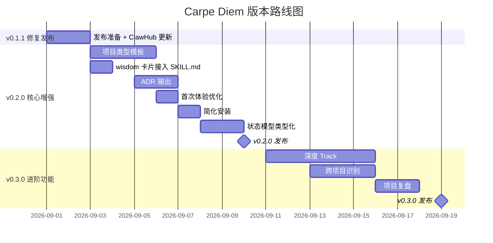

# Carpe Diem 项目进展与后续计划

> 更新日期：2026-08-30
> 会话摘要：使用 AgentTeams 进行项目评审、改进和智慧库建设

---

## 一、已完成的工作

### 1. 项目全面评审（AgentTeams 三轮）

| 轮次 | 团队 | 成员 | 产出 |
|------|------|------|------|
| 第一轮 | carpe-diem-review | 安全分析师、架构评审员、代码评审员 | 安全审计、架构评分、代码质量报告 |
| 第二轮 | carpe-diem-improve | 安全工程师、i18n 文档工程师、代码重构工程师 | 实际代码和文档改进 |
| 第三轮 | carpe-diem-wisdom | 研究员、蒸馏师 ×2、整合师 | 方法论卡片库 |

### 2. 已完成的改进

#### 代码与配置

| 改进 | 文件 | 内容 |
|------|------|------|
| 权限声明 | `manifest.json` | 新增 `required_capabilities` 字段 |
| 英文版文件 | `manifest.json` | 加入 `SKILL.en.md` 到文件列表 |

#### SKILL.md 文档改进

| 改进 | 位置 | 内容 |
|------|------|------|
| Trigger 条件块 | 新增 `## Trigger` 章节 | 明确激活/不激活场景 |
| 阶段转换规则 | `## 每次调用` 下新增 | 12 条阶段转换规则 |
| 下一个项目循环 | 新增 `## 下一个项目` 章节 | completed → discover 闭环 |

#### 新建文件

| 文件 | 内容 |
|------|------|
| `SKILL.en.md` | 完整英文版 SKILL（4991 字节） |
| `references/stage-transition-graph.md` | Mermaid 状态转换图 + 阶段说明 |
| `references/wisdom/README.md` | 智慧库根索引 |
| `references/wisdom/real-world-patterns/README.md` | 实战模式卡片说明 |
| `references/wisdom/real-world-patterns/claude-code-best-practices.md` | Claude Code 最佳实践 |
| `references/wisdom/real-world-patterns/building-effective-agents.md` | 构建有效 AI Agent |
| `references/wisdom/real-world-patterns/context-engineering.md` | AI Agent 上下文工程 |
| `references/wisdom/real-world-patterns/agent-skills.md` | Agent Skills 装备 |
| `references/wisdom/researcher-t1-summary.md` | 7 篇 Anthropic 博客文章摘要 |

---

## 二、当前项目状态

```
carpe-diem/
├── SKILL.md                         ✅ 已改进（+Trigger +阶段转换 +下一个项目）
├── SKILL.en.md                      ✅ 新建（英文版）
├── manifest.json                    ✅ 已改进（+required_capabilities +SKILL.en.md）
├── references/
│   ├── methodology.md               ✅
│   ├── safety-boundaries.md         ✅
│   ├── state-schema.md              ✅
│   ├── stage-transition-graph.md    ✅ 新建
│   ├── stages/
│   │   ├── discover.md              ✅
│   │   ├── validate.md              ✅
│   │   ├── plan.md                  ✅
│   │   └── track.md                 ✅
│   └── wisdom/                      ✅ 新建（方法论卡片库）
│       ├── README.md
│       ├── researcher-t1-summary.md
│       └── real-world-patterns/
│           ├── README.md
│           ├── claude-code-best-practices.md
│           ├── building-effective-agents.md
│           ├── context-engineering.md
│           └── agent-skills.md
├── scripts/
│   └── carpe_diem.py               ✅ 已有路径遍历防护
├── templates/
│   ├── project-plan.md              ✅
│   ├── project-handoff.md           ✅
│   └── progress-summary.md          ✅
├── adapters/
│   ├── codex/INSTALL.md             ✅
│   ├── claude-code/INSTALL.md       ✅
│   ├── cursor/INSTALL.md            ✅
│   └── openclaw/INSTALL.md          ✅
├── tests/                           ✅ 1061 行测试
│   ├── test_state.py (264行)
│   ├── test_plan.py (151行)
│   ├── test_project.py (97行)
│   ├── test_structure.py (127行)
│   ├── test_evidence.py
│   ├── test_install.py
│   ├── test_doctor.py
│   └── test_guidance.py
└── docs/
    ├── internal-testing.md
    └── superpowers/
        ├── specs/2026-08-27-carpe-diem-design.md
        └── plans/2026-08-27-carpe-diem-v0.1-implementation.md
```

---

## 三、后续计划

### P0（v0.1.1 — 发布前必须完成）

| 序号 | 事项 | 说明 |
|------|------|------|
| 1 | 将 wisdom 卡片接入 SKILL.md | 在"每次调用"流程中增加链路：当用户方向匹配某个模式时自动加载对应卡片 |
| 2 | 验证安装流程 | 用 `install plan/apply/verify` 完整测试安装，确保 ClawHub 发布可用 |
| 3 | 更新 ClawHub 页面 | 发布最新版本到 ClawHub，更新英文 description |

### P1（v0.2.0 — 核心功能增强）

| 序号 | 事项 | 说明 |
|------|------|------|
| 1 | **项目类型模板** | 在 `references/wisdom/project-archetypes/` 下创建 CLI 工具、Web 应用、开发者工具三类模板 |
| 2 | **方法论卡片接入 SKILL.md** | 修改 SKILL.md 的"每次调用"流程，让 Agent 在用户方向匹配时自动加载 wisdom 卡片 |
| 3 | **ADR 输出** | Plan 阶段的架构决策自动生成 `docs/adr/` 目录下的 ADR 文件 |
| 4 | **首次体验优化** | 先问一个问题再读方法论，降低首次摩擦 |
| 5 | **简化安装** | 一键安装脚本（`curl ... | sh`） |
| 6 | **状态模型类型化** | 引入 `dataclasses` 或 `pydantic` 建模 Profile/Project 状态 |
| 7 | **Python 脚本降级方案** | 脚本不可用时提供纯 Markdown 降级方案 |

### P2（v0.3.0 — 进阶功能）

| 序号 | 事项 | 说明 |
|------|------|------|
| 1 | **深度 Track** | 支持 CI/CD 健康、Issue 分析、依赖健康等多维度证据 |
| 2 | **跨项目模式识别** | 用户画像跨项目累积，形成能力进化线和模式识别 |
| 3 | **项目复盘报告** | Track → Completed 时自动产出复盘 Markdown |
| 4 | **多项目并行支持** | 项目列表、归档、切换 |
| 5 | **i18n 框架** | 多语言支持，不只是中英文 |
| 6 | **协作模式** | 多 Agent 追踪同一项目 |
| 7 | **集体智慧层** | 匿名化验证数据库，社区经验共享 |

### P3（长期规划）

| 序号 | 事项 | 说明 |
|------|------|------|
| 1 | 持续从 AI 公司博客蒸馏新卡片 | 建立定期蒸馏流程，跟踪 Anthropic/OpenAI 最新文章 |
| 2 | 用户反馈驱动的迭代 | 根据真实用户反馈调整方法论和流程 |
| 3 | 项目类型模板扩展 | 社区贡献的模板库 |

---

## 四、待发布的版本



---

## 五、重要说明

### 已经修复的安全问题

- **TT2 路径遍历漏洞**：已在 `validate_snapshot_files()` 中实现双重防护（拒绝绝对路径 + `..` 段 + resolve 后 relative_to 验证），并已有测试覆盖
- **LP3 权限声明缺失**：`manifest.json` 已添加 `required_capabilities` 字段
- **SQP-1 触发词过宽**：SKILL.md 已添加 `## Trigger` 章节明确激活条件
- **SQP-3 全中文**：SKILL.en.md 已创建，manifest.json 已加入文件列表

### HA7CH School 引用

设计文档中的 HA7CH School 引用已移除，替换为"带领式引导"的实质性描述。