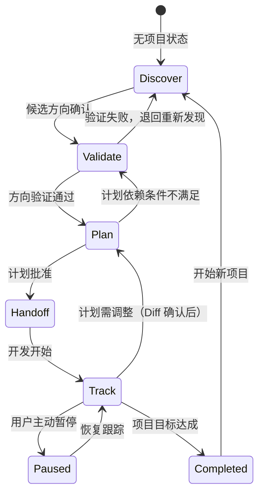

# 阶段状态转换图

> 本文档定义 Carpe Diem 四阶段间的转换规则、进入条件和退出条件。

---

## 状态转换图

---

## 阶段说明

### Discover

| 项目 | 内容 |
|------|------|
| **一句话本质** | 不急着想功能，先找一个用户比别人更容易看见、也更愿意长期解决的问题 |
| **进入条件** | 无项目状态，或 `phase === "discover"` |
| **退出条件** | 用户明确确认一个候选方向 |
| **回退目标** | 无（初始阶段） |
| **状态 phase 值** | `discover` |

### Validate

| 项目 | 内容 |
|------|------|
| **一句话本质** | 一个点子只有经得起现实世界的反证，才值得变成项目 |
| **进入条件** | `phase === "validate"`，或从 Discover 确认方向后进入 |
| **退出条件** | 验证结果为 `PASS`，用户确认进入 Plan |
| **回退目标** | `discover`（方向验证失败时） |
| **状态 phase 值** | `validate` |

### Plan

| 项目 | 内容 |
|------|------|
| **一句话本质** | 把未来开发中最昂贵的决定提前做完 |
| **进入条件** | `phase === "plan"`，或从 Validate 通过后进入 |
| **退出条件** | 计划无空白占位、无内部矛盾，用户批准最终计划 |
| **回退目标** | `validate`（计划依赖条件不满足时） |
| **状态 phase 值** | `plan` → `handoff` |

### Handoff

| 项目 | 内容 |
|------|------|
| **一句话本质** | 计划已经完成，Carpe Diem 从这里开始停止开发职责 |
| **进入条件** | 计划批准后自动进入 |
| **退出条件** | 生成交接文档，用户确认开始开发 |
| **回退目标** | `plan`（交接内容需调整时） |
| **状态 phase 值** | `handoff` |

### Track

| 项目 | 内容 |
|------|------|
| **一句话本质** | 对照计划和证据看清真实进度，不做监督式催促，也不越界开发 |
| **进入条件** | `phase === "track"`，或从 Handoff 确认后进入 |
| **退出条件** | 项目目标达成 → `completed`；用户主动暂停 → `paused` |
| **回退目标** | `plan`（计划需调整，Diff 确认后） |
| **状态 phase 值** | `track` |

### Paused

| 项目 | 内容 |
|------|------|
| **一句话本质** | 项目暂停，状态保留，可随时恢复 |
| **进入条件** | 用户主动暂停 |
| **退出条件** | 用户希望恢复 → `track` |
| **状态 phase 值** | `paused` |

### Completed

| 项目 | 内容 |
|------|------|
| **一句话本质** | 项目目标已达成，可回顾复盘或开始新项目 |
| **进入条件** | 项目目标达成，用户确认完成 |
| **退出条件** | 用户希望开始新项目 → `discover` |
| **状态 phase 值** | `completed` |

---

## 转换规则速查

| 从 | 到 | 条件 |
|----|----|------|
| discover | validate | 用户确认候选方向 |
| validate | discover | 方向验证失败，退回重新发现 |
| validate | plan | 方向验证通过 |
| plan | validate | 计划依赖条件不满足 |
| plan | handoff | 计划批准 |
| handoff | track | 开发开始 |
| track | plan | 计划需调整（展示 Diff 并确认后） |
| track | paused | 用户主动暂停 |
| paused | track | 用户希望恢复 |
| track | completed | 项目目标达成 |
| completed | discover | 开始新项目 |